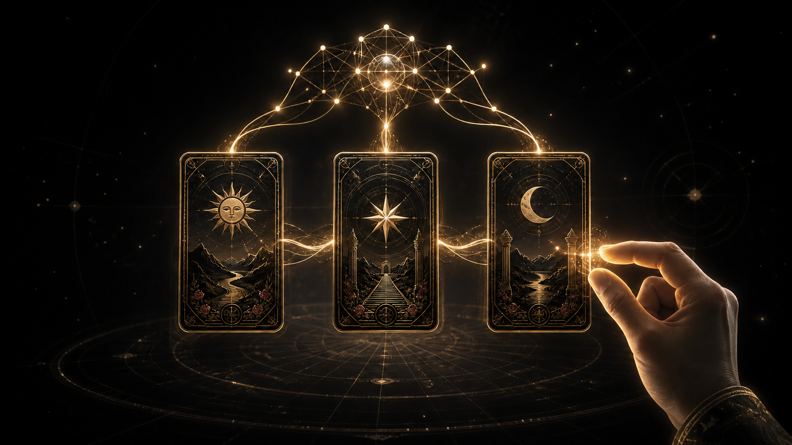

# AI手势塔罗

一款将 AI 手势交互与 AI 三牌解读融入核心玩法的浏览器塔罗游戏。

玩家可以直接用手完成洗牌、抽牌、移动和落牌。完成由“现状、核心影响、发展建议”组成的三牌牌阵后，AI 会结合三张牌的牌面、正逆位和所选方向，生成一段相互关联的整体解读与现实行动建议。



## 游戏介绍

AI手势塔罗把 AI 放进了游戏的输入与结果生成环节，而不是将它作为独立的聊天功能附加在页面上。

开始游戏后，玩家先选择感兴趣的解读方向，再通过摄像头进行非接触式操作。游戏识别张开手掌、捏合与握拳等动作，并将它们转换为牌桌中的移动、抓牌和落牌操作。玩家依次选出三张牌并放入对应位置，完成牌阵后进入 AI 解读阶段。

AI 不会把三张牌拆成互不相关的固定释义，而是结合牌阵位置、牌面信息、正逆位和解读方向，分析三张牌之间的呼应、张力与发展变化，最终生成整体结论、逐牌说明、综合解读及行动建议。

> 游戏内容仅供娱乐与自我反思，不替代医疗、法律、投资或其他专业建议。

## 核心玩法

1. 选择手势模式或鼠标模式。
2. 选择本次解读方向。
3. 等待牌组完成洗牌。
4. 从完整的 78 张塔罗牌中依次抽取三张牌。
5. 将三张牌放入“现状、核心影响、发展建议”三个牌位。
6. AI 串联本次牌阵，生成完整解读与一项可执行的行动建议。

<p align="center"><strong><font color="red">⚠️ 图片待更新：请补充“选择操作模式与解读方向”的引导界面截图。</font></strong></p>

<p align="center"><strong><font color="red">⚠️ 图片待更新：请补充“使用手势抽取并放置三张牌”的核心玩法截图。</font></strong></p>

<p align="center"><strong><font color="red">⚠️ 图片待更新：请补充“三牌汇聚并生成 AI 解读”的最终结果截图。</font></strong></p>

## 解读方向

当前版本提供四种解读方向：

| 方向 | 游戏中的问题 |
| --- | --- |
| 感情 | 我的感情关系接下来会如何发展？ |
| 事业 | 我的事业接下来会如何发展？ |
| 心境 | 我当下的内在心境正在告诉我什么？ |
| 灵性 | 我当前的灵性道路需要怎样的指引？ |

这些方向用于为本次三牌牌阵建立语境。AI 会使用审慎、非确定性的表达提供反思性解读，不会将结果描述为必然发生的事实。

## 手势操作

| 手势 | 游戏操作 |
| --- | --- |
| ✋ 张开手掌 | 移动游戏指针并寻找目标卡牌 |
| 👌 捏合手指 | 抓取卡牌并拖动到牌阵位置 |
| ✊ 握拳 | 将卡牌放入当前牌位并翻开 |
| 🖱️ 鼠标 | 摄像头不可用时完成同样的抽牌流程 |

摄像头画面仅在浏览器本地用于识别手部动作。浏览器不会把摄像头画面发送给 AI 解读服务。

## AI 如何进入核心玩法

游戏包含两个连续的 AI 环节：

1. **AI 理解玩家动作**：实时识别手的位置和动作，让玩家能够直接用手与三维牌桌交互。
2. **AI 生成本局内容**：在三张牌全部落位后，结合牌阵结构、牌面、正逆位、关键词和所选方向，生成只属于本局的关联解读。

这两个环节形成“动作识别 → 完成牌阵 → 生成反馈”的完整闭环。没有手势识别，玩家无法获得主要的非接触式操作体验；没有生成式解读，三张牌也不会形成随每局变化的整体叙事。

## 主要功能

- 完整的 78 张塔罗牌，包括 22 张大阿尔卡那和 56 张小阿尔卡那。
- 三牌牌阵，对应现状、核心影响和发展建议。
- 每张牌独立生成正位或逆位结果。
- 感情、事业、心境和灵性四种解读方向。
- AI 生成整体结论、逐牌说明、综合变化逻辑和行动建议。
- 张开、捏合、握拳三种手势组成完整抽牌操作。
- 鼠标备用模式，摄像头不可用时仍可体验完整流程。
- 权杖、圣杯、宝剑和金币对应不同的元素粒子效果。
- 首次进入时提供操作模式、主题选择及抽牌步骤引导。
- AI 服务不可用时给出明确提示，不影响本地牌面与固定牌义展示。

## AI 解读流程

```text
玩家选择解读方向
        ↓
通过手势完成三张牌的抽取与落位
        ↓
整理牌阵位置、牌名、正逆位及相关牌义
        ↓
AI 分析三张牌之间的联系与发展变化
        ↓
返回整体结论、逐牌解读、综合解读与行动建议
```

AI 输出经过固定结构校验，并遵循以下原则：

- 不宣称能够确定未来，不使用“注定”“一定会”等绝对表达。
- 不制造恐惧，不虚构玩家未提供的经历。
- 不提供医疗、法律或投资等高风险专业结论。
- 行动建议保持现实、温和且可以执行。

## 技术实现

| 技术 | 用途 |
| --- | --- |
| JavaScript / HTML / CSS | 游戏流程、界面状态与交互逻辑 |
| Three.js | 三维牌桌、卡牌、灯光、动画与粒子效果 |
| MediaPipe Hands | 浏览器本地手部关键点与手势识别 |
| Anime.js | 洗牌、界面过渡与结果呈现动画 |
| DeepSeek API | 生成结构化的三牌关联解读 |
| Node.js | 本地静态服务与 AI API 代理 |
| EdgeOne Makers | 在线环境中的前端托管与 Cloud Functions |

## 本地运行

### 环境要求

- Node.js 20 或更高版本
- 支持 WebGL 的现代浏览器
- 手势模式需要摄像头权限
- AI 解读需要 DeepSeek API Key

### 安装与配置

```bash
npm install
```

在项目根目录创建 `.env`：

```dotenv
PORT=8090
DEEPSEEK_API_KEY=你的密钥
# 可选：覆盖默认模型
DEEPSEEK_MODEL=deepseek-v4-pro
```

不要把真实密钥提交到仓库或写入前端代码。浏览器只访问项目自己的 API 路由，不会接触 API Key。

### 启动项目

```bash
npm start
```

然后访问 [http://localhost:8090](http://localhost:8090)。摄像头 API 需要安全上下文，请使用 `localhost` 或 HTTPS，不要直接通过 `file://` 打开 `index.html`。

Windows 用户也可以运行：

```powershell
.\start-local.ps1
```

该脚本会读取 `.env` 中的 `PORT`，并在当前窗口启动项目。

## EdgeOne Makers 本地开发

项目提供以下 Cloud Functions：

- `cloud-functions/api/reading.js`：单牌 AI 解读接口。
- `cloud-functions/api/prophecy.js`：当前三牌牌阵的 AI 关联解读接口。

在 Makers 项目环境变量中配置 `DEEPSEEK_API_KEY`，可选配置 `DEEPSEEK_MODEL`，然后运行：

```bash
PAGES_SOURCE=skills edgeone makers dev --name tarot-app --skip-env-sync
```

通过 [http://127.0.0.1:8088/](http://127.0.0.1:8088/) 访问本地环境。线上环境同样需要在项目环境变量中配置密钥。

## 测试与构建检查

运行完整测试：

```bash
npm test
```

运行语法与构建检查：

```bash
npm run build
```

## 项目结构

```text
tarot-app/
├── cloud-functions/api/       # EdgeOne Makers AI 接口
├── docs/                      # 项目文档、参赛材料与待更新截图
├── public/                    # 本地手势识别模型资源
├── src/client/                # 引导、动画、AI 请求与牌阵 Prompt
├── src/data/                  # 78 张塔罗牌数据
├── src/server/                # AI 服务、校验与限流逻辑
├── tarot_img/                 # 塔罗牌面资源
├── tests/                     # 客户端、服务端与冒烟测试
├── index.html                 # 当前游戏入口与三维场景
├── server.mjs                # Node.js 本地服务器
└── package.json              # 项目命令与依赖
```

## 项目仓库

源代码：[github.com/ythere-y/tarot-app](https://github.com/ythere-y/tarot-app)

---

本项目用于探索 AI 手势输入、生成式内容与游戏核心循环的结合方式。
